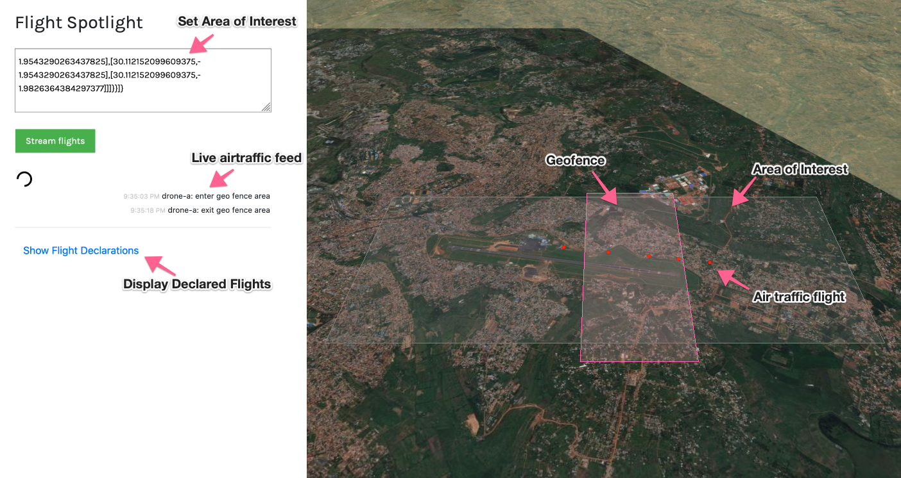
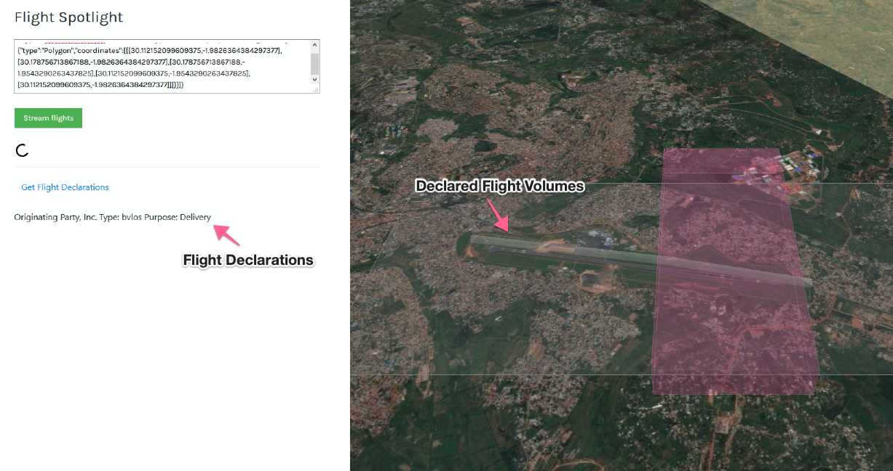
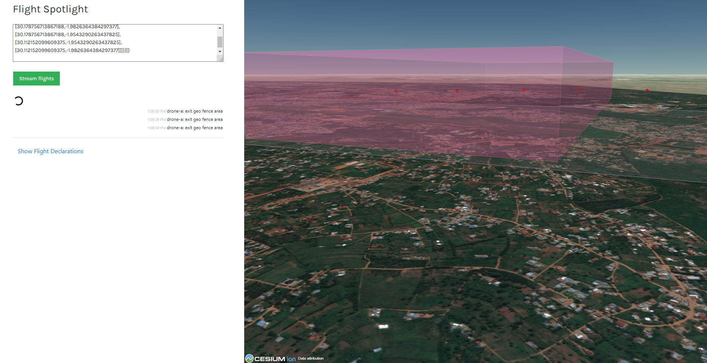
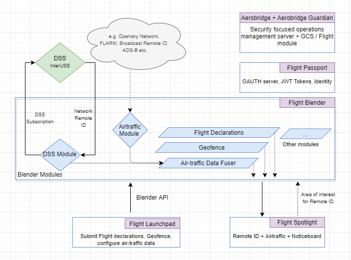

Flight Spotlight enables you to see flights _in realtime_ by subscribing to updates to a geographic area. It can display live manned and unmanned air traffic on a 3D globe and additionally display geo-fences etc. In the context of UTM / U-Space you can identify drone traffic using Network Remote-ID, accept feeds for broadcast Remote-ID data and plug in live ADS-B or other air-traffic data. From an unmanned aviation perspective, currently there is  ASTM Network and Broadcast Remote-ID standards and they are implemented, as other standards are released, they can be enabled as well.

The live feed and the identification data is processed using a complementary server application called [Flight Blender](https://flightblender.com). Flight Blender can fuse and stream manned and unmanned flight data using multiple technologies: ADS-B, Radar, FLARM etc. Network Remote-ID capabilities are also provided by Flight Blender as a specialized module.

## Features

This software is compatible with all ASTM and EuroCAE upcoming standards for UTM / U-Space

- Geofencing display compatible with [EuroCAE ED-269](https://eshop.eurocae.net/eurocae-documents-and-reports/ed-269/)
- Display Network Remote ID via connections to [DSS](https://github.com/interuss/dss) using [Flight Blender](https://flightblender.com)
- Display ADS-B and other traffic using streamlined [JSON format](https://github.com/openskies-sh/airtraffic-data-protocol-development) using a Flight Blender backend
- Upload JSON based [flight declarations](https://github.com/openskies-sh/flight-declaration-protocol-development) and/or mission plans from ground control stations.

## Join the OpenUTM community

Join our Discord community via [this link](https://discord.gg/dnRxpZdd9a) 💫

## Screenshots

Initial screen

Declared Flights

All data is in 3D + time

## Running locally / Deployment
Refer to the (deployment)[https://github.com/openutm/deployment] repository to see how you can deploy this server along with instructions and sample environment file. 

## Openskies stack

Flight tracking data can be submitted to Flight Spotlight by an Display provider like [Flight Blender](https://github.com/openskies-sh/flight-blender) via the accompanying software like [Flight Launchpad](https://github.com/openskies-sh/flight-launchpad), for more information see the diagram below

## Logo source

[Hatchful](https://hatchful.shopify.com/)
